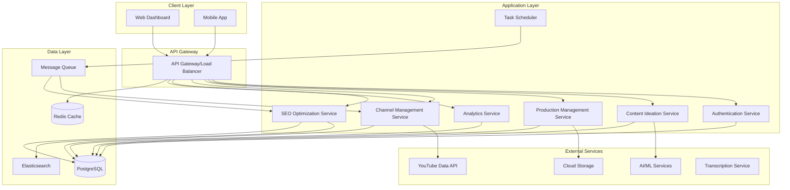

# YouTube Content Creation Company - Technical Specification

## 1. System Architecture

### 1.1 High-Level Architecture



### 1.2 Component Descriptions

| Component | Responsibility | Technology |
|-----------|---------------|------------|
| API Gateway | Request routing, rate limiting, load balancing | Kong/Nginx |
| Auth Service | User authentication, authorization, team management | Node.js/Express |
| Content Ideation Service | Trend analysis, topic research, content planning | Python/FastAPI |
| Production Management | Video production workflow, asset management | Node.js/NestJS |
| Channel Management | YouTube operations, publishing, playlist management | Node.js/Express |
| SEO Optimization | Keyword research, metadata optimization, A/B testing | Python/FastAPI |
| Analytics Service | Performance tracking, reporting, insights | Python/FastAPI |
| Task Scheduler | Automated publishing, monitoring, maintenance | Node.js/Bull |

## 2. Technology Stack

### 2.1 Backend Services

```yaml
Primary Languages:
  - Node.js 20.x (TypeScript)
  - Python 3.11+

Frameworks:
  - Express.js / NestJS (Node.js microservices)
  - FastAPI (Python services)
  - Socket.io (Real-time updates)

API:
  - REST (primary)
  - GraphQL (complex queries)
  - WebSockets (real-time notifications)
```

### 2.2 Frontend

```yaml
Web Application:
  - Framework: React 18+ with TypeScript
  - State Management: Redux Toolkit / Zustand
  - UI Library: Material-UI / Tailwind CSS
  - Build Tool: Vite
  - Data Fetching: React Query

Mobile:
  - Framework: React Native
  - State: Redux Toolkit
```

### 2.3 Data Storage

```yaml
Primary Database:
  - PostgreSQL 15+ (relational data)
  
Cache:
  - Redis 7+ (session, cache, rate limiting)
  
Search:
  - Elasticsearch 8+ (content search, analytics)
  
Object Storage:
  - AWS S3 / Google Cloud Storage (video assets, thumbnails)
  
Message Queue:
  - RabbitMQ / Redis Queue (async tasks)
```

### 2.4 External Services

```yaml
Video Platform:
  - YouTube Data API v3
  - YouTube Analytics API

AI/ML Services:
  - OpenAI API (content ideas, script generation)
  - Google Cloud Natural Language API
  - TensorFlow (custom models)

Transcription:
  - AssemblyAI / Whisper API

Video Processing:
  - FFmpeg (server-side)
  - AWS MediaConvert

Monitoring:
  - Datadog / New Relic
  - Sentry (error tracking)

CI/CD:
  - GitHub Actions
  - Docker / Kubernetes
```

## 3. Data Models

### 3.1 Core Entities Schema

```typescript
// User & Teams
interface User {
  id: UUID;
  email: string;
  passwordHash: string;
  firstName: string;
  lastName: string;
  role: 'admin' | 'editor' | 'creator' | 'analyst';
  teamId: UUID;
  permissions: string[];
  createdAt: DateTime;
  updatedAt: DateTime;
  lastLoginAt: DateTime;
}

interface Team {
  id: UUID;
  name: string;
  subscriptionTier: 'starter' | 'professional' | 'enterprise';
  channelLimit: number;
  storageLimit: number; // in GB
  createdAt: DateTime;
  settings: TeamSettings;
}

interface TeamSettings {
  defaultPublishTime: string;
  autoPublish: boolean;
  notificationPreferences: object;
  brandingGuidelines: object;
}

// Channel Management
interface Channel {
  id: UUID;
  teamId: UUID;
  youtubeChannelId: string;
  name: string;
  niche: string;
  tags: string[];
  status: 'active' | 'paused' | 'archived';
  brandVoice: string;
  targetAudience: string;
  publishSchedule: Schedule[];
  seoStrategy: SEOStrategy;
  analytics: ChannelAnalytics;
  createdAt: DateTime;
  updatedAt: DateTime;
}

interface Schedule {
  dayOfWeek: number;
  time: string; // HH:MM
  timezone: string;
}

interface SEOStrategy {
  primaryKeywords: string[];
  secondaryKeywords: string[];
  targetCTR: number;
  thumbnailStyle: string;
  titleFormula: string;
}

// Content Pipeline
interface ContentIdea {
  id: UUID;
  channelId: UUID;
  title: string;
  description: string;
  niche: string;
  keywords: string[];
  trendScore: number; // 0-100
  competitionLevel: 'low' | 'medium' | 'high';
  estimatedViews: number;
  status: 'suggested' | 'approved' | 'rejected' | 'in_production';
  sources: ResearchSource[];
  createdBy: UUID;
  createdAt: DateTime;
  assignedTo: UUID | null;
}

interface ResearchSource {
  type: 'trend' | 'competitor' | 'keyword_research' | 'manual';
  url: string;
  relevanceScore: number;
  notes: string;
}

interface Video {
  id: UUID;
  contentIdeaId: UUID;
  channelId: UUID;
  youtubeVideoId: string | null;
  title: string;
  description: string;
  tags: string[];
  category: string;
  status: VideoStatus;
  production: ProductionData;
  seo: SEOData;
  assets: AssetData;
  publishSettings: PublishSettings;
  analytics: VideoAnalytics;
  createdAt: DateTime;
  updatedAt: DateTime;
  publishedAt: DateTime | null;
}

type VideoStatus = 
  | 'scripting'
  | 'recording'
  | 'editing'
  | 'review'
  | 'approved'
  | 'scheduled'
  | 'published'
  | 'unlisted'
  | 'private';

interface ProductionData {
  scriptId: UUID | null;
  rawFootageUrls: string[];
  editedVideoUrl: string | null;
  thumbnailUrls: string[];
  duration: number; // seconds
  resolution: string;
  aspectRatio: string;
  subtitles: SubtitleData[];
  assignedEditor: UUID | null;
  dueDate: DateTime | null;
}

interface SubtitleData {
  language: string;
  url: string;
  format: 'srt' | 'vtt';
}

interface SEOData {
  targetKeyword: string;
  relatedKeywords: string[];
  optimizedTitle: string;
  optimizedDescription: string;
  hashtags: string[];
  customThumbnail: string;
  thumbnailABTest: ABTestData | null;
  endScreen: EndScreenConfig;
  cards: CardConfig[];
}

interface ABTestData {
  variants: ThumbnailVariant[];
  winningVariant: string | null;
  testDuration: number; // hours
  impressions: Record<string, number>;
  ctr: Record<string, number>;
}

interface ThumbnailVariant {
  id: string;
  url: string;
  description: string;
}

interface PublishSettings {
  scheduledFor: DateTime | null;
  visibility: 'public' | 'unlisted' | 'private';
  autoPublish: boolean;
  notifySubscribers: boolean;
  playlist: string | null;
  publishToCommunity: boolean;
}

// Analytics
interface VideoAnalytics {
  views: number;
  likes: number;
  dislikes: number;
  comments: number;
  shares: number;
  watchTime: number; // seconds
  averageViewDuration: number;
  averageViewPercentage: number;
  ctr: number; // percentage
  impressions: number;
  subscribersGained: number;
  revenueEstimate: number;
  engagement: EngagementMetrics;
  demographics: DemographicData;
  trafficSources: TrafficSourceData[];
  retentionCurve: RetentionPoint[];
  lastUpdated: DateTime;
}

interface EngagementMetrics {
  engagementRate: number;
  likeRate: number;
  commentRate: number;
  shareRate: number;
}

interface DemographicData {
  ageGroups: Record<string, number>;
  gender: Record<string, number>;
  geography: Record<string, number>;
}

interface TrafficSourceData {
  source: string;
  views: number;
  percentage: number;
}

interface RetentionPoint {
  timestamp: number;
  retentionPercentage: number;
}

interface ChannelAnalytics {
  totalViews: number;
  totalSubscribers: number;
  totalVideos: number;
  averageViewsPerVideo: number;
  subscriberGrowthRate: number;
  totalWatchTime: number;
  averageCTR: number;
  estimatedRevenue: number;
  topPerformingVideos: UUID[];
  growthTrends: GrowthTrendData[];
}

interface GrowthTrendData {
  date: Date;
  subscribers: number;
  views: number;
  watchTime: number;
}

// Workflow & Tasks
interface Task {
  id: UUID;
  type: TaskType;
  videoId: UUID | null;
  channelId: UUID | null;
  assignedTo: UUID;
  status: 'pending' | 'in_progress' | 'completed' | 'blocked';
  priority: 'low' | 'medium' | 'high' | 'urgent';
  dueDate: DateTime;
  dependencies: UUID[];
  metadata: object;
  createdAt: DateTime;
  completedAt: DateTime | null;
}

type TaskType = 
  | 'research'
  | 'script_writing'
  | 'recording'
  | 'editing'
  | 'thumbnail_creation'
  | 'seo_optimization'
  | 'review'
  | 'publish';
```

### 3.2 Database Schema (PostgreSQL)

```sql
-- Users and Teams
CREATE TABLE teams (
    id UUID PRIMARY KEY DEFAULT gen_random_uuid(),
    name VARCHAR(255) NOT NULL,
    subscription_tier VARCHAR(50) NOT NULL,
    channel_limit INTEGER NOT NULL,
    storage_limit INTEGER NOT NULL,
    settings JSONB,
    created_at TIMESTAMP WITH TIME ZONE DEFAULT CURRENT_TIMESTAMP,
    updated_at TIMESTAMP WITH TIME ZONE DEFAULT CURRENT_TIMESTAMP
);

CREATE TABLE users (
    id UUID PRIMARY KEY DEFAULT gen_random_uuid(),
    email VARCHAR(255) UNIQUE NOT NULL,
    password_hash VARCHAR(255) NOT NULL,
    first_name VARCHAR(100) NOT NULL,
    last_name VARCHAR(100) NOT NULL,
    role VARCHAR(50) NOT NULL,
    team_id UUID REFERENCES teams(id) ON DELETE CASCADE,
    permissions JSONB,
    created_at TIMESTAMP WITH TIME ZONE DEFAULT CURRENT_TIMESTAMP,
    updated_at TIMESTAMP WITH TIME ZONE DEFAULT CURRENT_TIMESTAMP,
    last_login_at TIMESTAMP WITH TIME ZONE
);

CREATE INDEX idx_users_team ON users(team_id);
CREATE INDEX idx_users_email ON users(email);

-- Channels
CREATE TABLE channels (
    id UUID PRIMARY KEY DEFAULT gen_random_uuid(),
    team_id UUID REFERENCES teams(id) ON DELETE CASCADE,
    youtube_channel_id VARCHAR(255) UNIQUE NOT NULL,
    name VARCHAR(255) NOT NULL,
    niche VARCHAR(100),
    tags TEXT[],
    status VARCHAR(50) NOT NULL DEFAULT 'active',
    brand_voice TEXT,
    target_audience TEXT,
    publish_schedule JSONB,
    seo_strategy JSONB,
    created_at TIMESTAMP WITH TIME ZONE DEFAULT CURRENT_TIMESTAMP,
    updated_at TIMESTAMP WITH TIME ZONE DEFAULT CURRENT_TIMESTAMP
);

CREATE INDEX idx_channels_team ON channels(team_id);
CREATE INDEX idx_channels_niche ON channels(niche);
CREATE INDEX idx_channels_status ON channels(status);

-- Content Ideas
CREATE TABLE content_ideas (
    id UUID PRIMARY KEY DEFAULT gen_random_uuid(),
    channel_id UUID REFERENCES channels(id) ON DELETE CASCADE,
    title VARCHAR(500) NOT NULL,
    description TEXT,
    niche VARCHAR(100),
    keywords TEXT[],
    trend_score INTEGER,
    competition_level VARCHAR(20),
    estimated_views INTEGER,
    status VARCHAR(50) NOT NULL DEFAULT 'suggested',
    sources JSONB,
    created_by UUID REFERENCES users(id),
    assigned_to UUID REFERENCES users(id),
    created_at TIMESTAMP WITH TIME ZONE DEFAULT CURRENT_TIMESTAMP,
    updated_at TIMESTAMP WITH TIME ZONE DEFAULT CURRENT_TIMESTAMP
);

CREATE INDEX idx_content_ideas_channel ON content_ideas(channel_id);
CREATE INDEX idx_content_ideas_status ON content_ideas(status);
CREATE INDEX idx_content_ideas_trend_score ON content_ideas(trend_score DESC);

-- Videos
CREATE TABLE videos (
    id UUID PRIMARY KEY DEFAULT gen_random_uuid(),
    content_idea_id UUID REFERENCES content_ideas(id),
    channel_id UUID REFERENCES channels(id) ON DELETE CASCADE,
    youtube_video_id VARCHAR(255) UNIQUE,
    title VARCHAR(500) NOT NULL,
    description TEXT,
    tags TEXT[],
    category VARCHAR(100),
    status VARCHAR(50) NOT NULL,
    production JSONB,
    seo JSONB,
    assets JSONB,
    publish_settings JSONB,
    created_at TIMESTAMP WITH TIME ZONE DEFAULT CURRENT_TIMESTAMP,
    updated_at TIMESTAMP WITH TIME ZONE DEFAULT CURRENT_TIMESTAMP,
    published_at TIMESTAMP WITH TIME ZONE
);

CREATE INDEX idx_videos_channel ON videos(channel_id);
CREATE INDEX idx_videos_status ON videos(status);
CREATE INDEX idx_videos_published_at ON videos(published_at);
CREATE INDEX idx_videos_youtube_id ON videos(youtube_video_id);

-- Video Analytics (Time-series data)
CREATE TABLE video_analytics (
    id UUID PRIMARY KEY DEFAULT gen_random_uuid(),
    video_id UUID REFERENCES videos(id) ON DELETE CASCADE,
    snapshot_date DATE NOT NULL,
    views INTEGER DEFAULT 0,
    likes INTEGER DEFAULT 0,
    comments INTEGER DEFAULT 0,
    shares INTEGER DEFAULT 0,
    watch